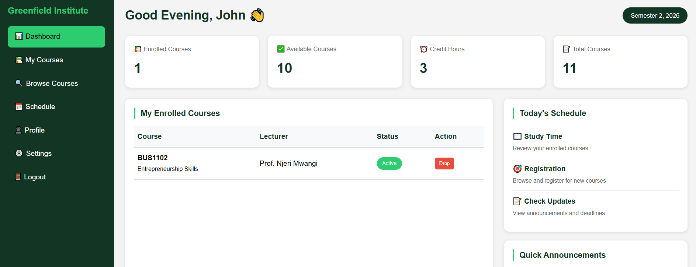
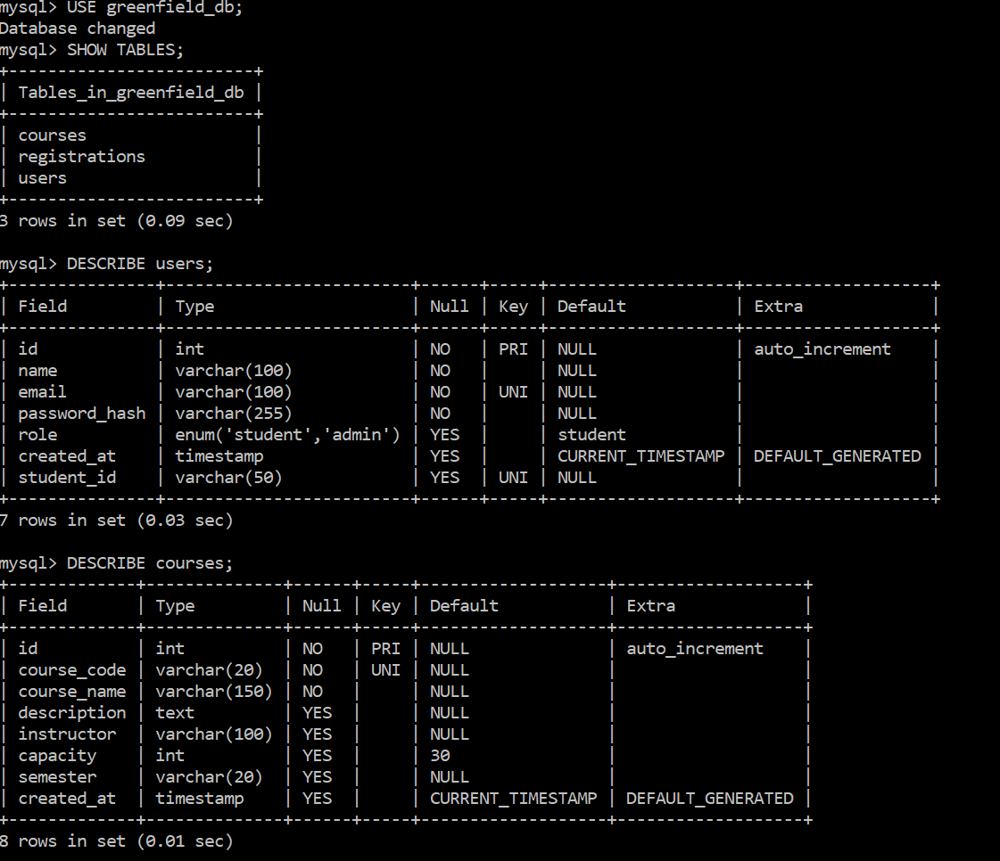

# Greenfield Institute - Course Registration System


## 📸 Screenshots

### 🔐 Login Page


### 📚 Course Listing Page


### 🗄️ Database Structure


*MySQL database showing users, courses, and registrations tables*

---

## 📚 Project Overview

A web-based course registration system for **Greenfield Institute** that replaces manual email and spreadsheet-based processes. This system streamlines registration, improves data accuracy, and enhances user experience for both students and administrators.

**Course:** ICS 2203 - Internet Application Programming  
**Institution:** JKUAT (Jomo Kenyatta University of Agriculture and Technology)

---

## 👥 Group 14 - Team Members

| Name | Registration Number | Role |
|------|-------------------|------|
| Kelvin Mutinda | SCM211-0325/2024 | Admin Pages |
| Ida Gakii | SCM211-0364/2024 | Student Pages |
| Natasha Hinga | SCM211-0311/2024 | Backend Development |
| Victor Ngatia | SCM211-0117/2023 | Backend Development |
| Vivian Leah Muthoni | SCM211-0340/2024 | Login & Registration |

**GitHub:** [@slate299](https://github.com/slate299)

---

## 🏗️ Technologies Used

| Tier | Technology | Role |
|------|------------|------|
| **Presentation** | HTML5, CSS3, JavaScript | User interface, responsive design, client-side validation |
| **Business Logic** | PHP 8.x | Authentication, business rules, XML processing |
| **Data Storage** | MySQL 8.0 | Persistent storage of users, courses, registrations |
| **Server** | Apache (XAMPP) | Local development environment |

---

## ✨ Features

### Students
| Feature | Description |
|---------|-------------|
| 🔐 Register Account | Create account with Student ID and secure password |
| 🔑 Login | Role-based login with Student/Admin toggle |
| 📚 Browse Courses | View all available courses with capacity |
| ✅ Register | Enroll in courses with duplicate prevention |
| 📖 My Courses | View all enrolled courses |
| 🗑️ Drop Course | Remove enrollment with confirmation modal |
| 🔍 Search/Filter | Search courses by name, filter by status |
| 🔒 Change Password | Update password securely |

### Administrators
| Feature | Description |
|---------|-------------|
| 📊 Dashboard | View statistics (students, courses, registrations) |
| ➕ Add Course | Create new courses |
| ✏️ Edit Course | Update course information |
| ❌ Delete Course | Remove courses (only if no students enrolled) |
| 👥 View Registrations | Monitor all student enrollments |
| 📥 Import XML | Import courses from XML file |
| 📤 Export XML | Export all courses to XML |

---

## 🗄️ Database Schema

### Tables

| Table | Columns | Purpose |
|-------|---------|---------|
| `users` | id, name, email, password_hash, role, student_id, created_at | Student & admin accounts |
| `courses` | id, course_code, course_name, description, instructor, capacity, semester | Course catalog |
| `registrations` | id, user_id, course_id, registration_date, status | Enrollment records |

### Relationships
- `registrations.user_id` → `users.id` (ON DELETE CASCADE)
- `registrations.course_id` → `courses.id` (ON DELETE CASCADE)
- Unique constraint `(user_id, course_id)` prevents duplicate registrations

---

## 📋 Sample Courses (Kenyan Context)

| Code | Course Name | Instructor | Semester |
|------|-------------|------------|----------|
| SMA3101 | Probability and Statistics III | Prof. James Otieno | Semester 1, 2026 |
| SMA2100 | Introduction to Abstract Algebra | Dr. Mercy Wanjiku | Semester 1, 2026 |
| ICS2402 | Internet Application Programming | Prof. Kamau Maina | Semester 1, 2026 |
| ICS2305 | System Analysis and Design | Dr. Achieng Omondi | Semester 2, 2026 |
| BUS1102 | Entrepreneurship Skills | Prof. Njeri Mwangi | Semester 2, 2026 |
| SMA1104 | Linear Algebra I | Dr. Odhiambo Oduor | Semester 1, 2026 |
| ICS2312 | Operating Systems II | Prof. Wanjiru Kariuki | Semester 2, 2026 |
| ICS2405 | Statistical Programming | Dr. Atieno Ochieng | Semester 2, 2026 |

---

## 🔐 Test Credentials

| Role | Email | Password |
|------|-------|----------|
| **Admin** | admin@greenfield.edu | admin123 |
| **Student** | john.mwangi@student.edu | student123 |
| **Student** | mary.wanjiku@student.edu | student123 |
| **Student** | peter.omondi@student.edu | student123 |
| **Student** | jane.achieng@student.edu | student123 |

---

## 🚀 Installation Guide

### Prerequisites
- XAMPP (Apache + PHP) or any PHP web server
- MySQL 8.0
- Web browser

### Step-by-Step Setup

#### 1. Clone the repository
```bash
git clone https://github.com/slate299/greenfield-registration.git
```

#### 2. Move to htdocs folder
```bash
# For XAMPP
mv greenfield-registration C:\xampp\htdocs\
```

#### 3. Import database
```bash
# Open MySQL
mysql -u root -p

# Create database
CREATE DATABASE greenfield_db;

# Import SQL file
USE greenfield_db;
SOURCE C:\xampp\htdocs\greenfield-registration\sql\greenfield_db.sql;
```

#### 4. Configure database connection
Edit `config/database.php`:

```php
$host = 'localhost';
$user = 'root';
$password = 'your_mysql_password';
$database = 'greenfield_db';
```

#### 5. Start server
- Start Apache in XAMPP Control Panel
- Visit: `http://localhost/greenfield-registration/login.php`

---

## 📂 Project Structure

```
greenfield-registration/
├── images/                     # Screenshots for README
│   ├── login.png
│   ├── courses.png
│   └── database.png
├── config/
│   └── database.php
├── includes/
│   └── functions.php
├── css/
├── js/
├── xml/
├── sql/
│   └── greenfield_db.sql
├── report.html
├── README.md
└── (all PHP files)
```

---

## 🏛️ Three-Tier Architecture Implementation

### 1. Presentation Tier (UI Layer)
**Technologies:** HTML5, CSS3, JavaScript

**Files:** `login.php`, `register.php`, `student_dashboard.php`, `admin_dashboard.php`, `my_courses.php`

### 2. Business Logic Tier (Application Layer)
**Technologies:** PHP 8.x

**Files:** `register_course.php`, `drop_course.php`, `add_course.php`, `edit_course.php`, `delete_course.php`, `import_xml.php`, `export_xml.php`, `includes/functions.php`

**Business Rules:**
- No duplicate course registrations
- Course capacity limits enforced
- Password hashing
- Role-based access control

### 3. Data Tier (Database Layer)
**Technologies:** MySQL 8.0

**Tables:** `users`, `courses`, `registrations`

---

## 📄 XML Integration

| Function | File | Description |
|----------|------|-------------|
| **Export** | `export_xml.php` | Converts MySQL course data to downloadable XML |
| **Import** | `import_xml.php` | Parses XML using PHP's SimpleXML and inserts into database |
| **Sample** | `xml/courses.xml` | Example XML structure for course data |

---

## ✅ Business Rules Enforced

| Rule | Implementation |
|------|----------------|
| No duplicate registrations | Database unique constraint + PHP check |
| Course capacity limits | Check enrolled count before INSERT |
| Secure passwords | `password_hash()` with bcrypt |
| SQL injection prevention | Prepared statements everywhere |
| Role-based access | `requireLogin()` and `requireAdmin()` functions |

---

## 📝 License

This project was created for educational purposes as part of ICS 2203 - Internet Application Programming at JKUAT.

---

## 👨‍💻 Author

**Natasha Hinga**  
GitHub: [@slate299](https://github.com/slate299)

**Group 14**  
Greenfield Institute of Science and Technology  